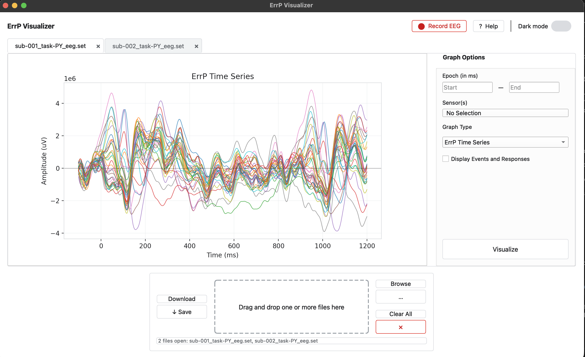
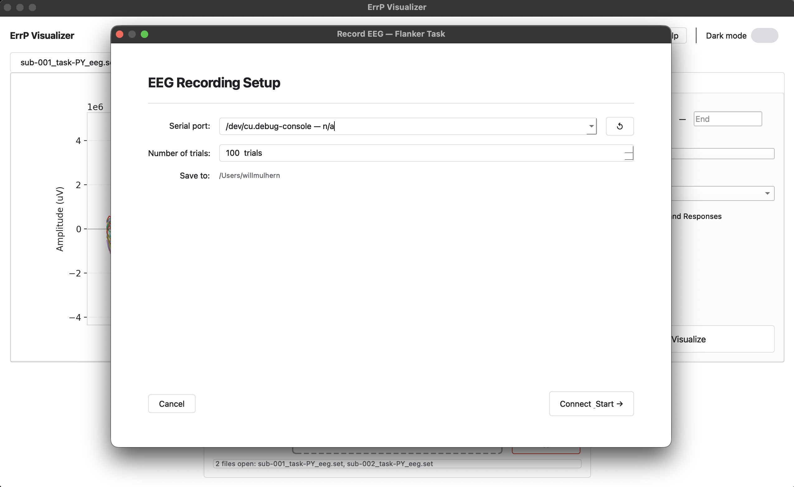
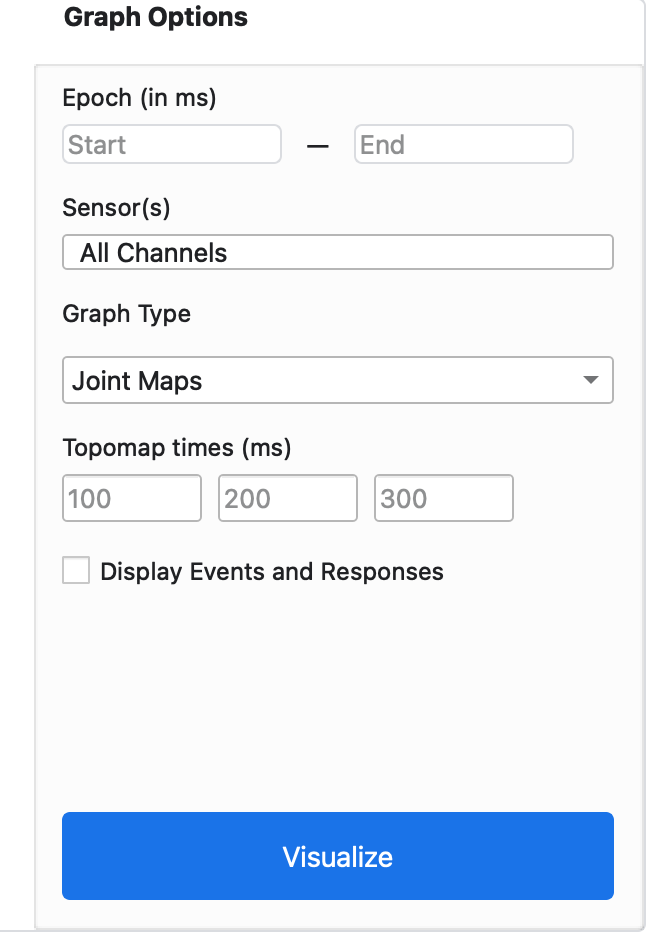
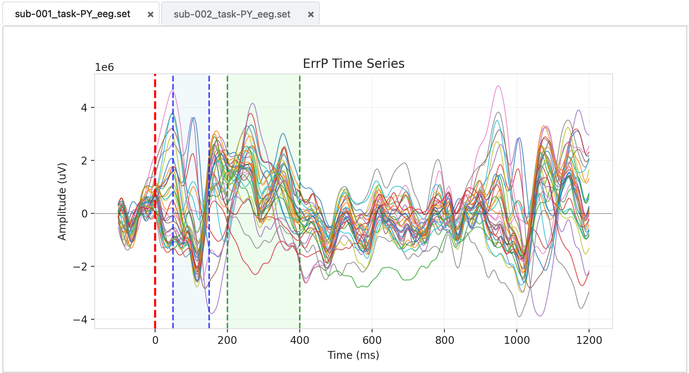
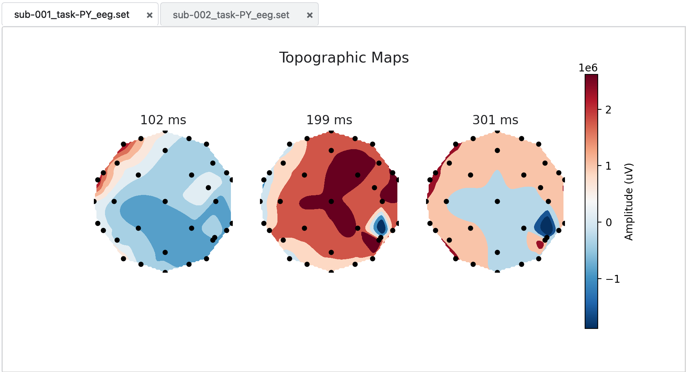
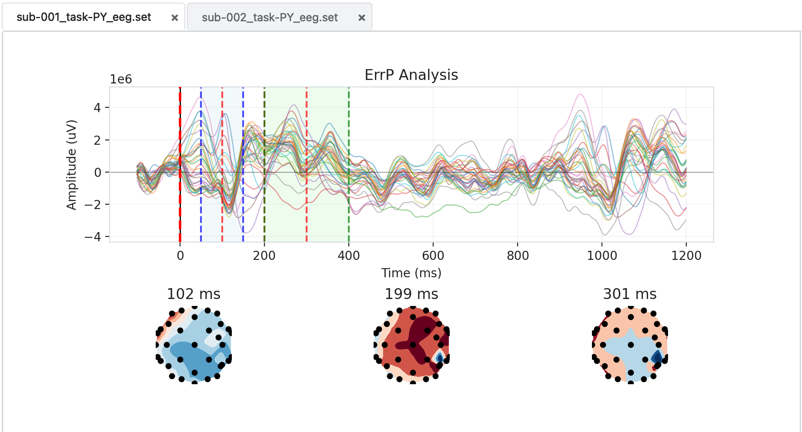

# ErrP Visualizer — User Guide

This guide walks through the day-to-day use of the **ErrP Visualizer**: loading EEG files, recording a new session with the built-in Flanker task, and interpreting the available plots.

---

## 1. Introduction

An **Error-Related Potential (ErrP)** is a brain signal that appears in EEG when a person perceives or makes an error. It has two characteristic components:

- **ERN / Ne** (≈ 50–150 ms after the error) — a negative deflection generated in the anterior cingulate cortex.
- **Pe** (≈ 200–400 ms) — a positive deflection reflecting conscious error awareness.

The ErrP Visualizer lets you record EEG during a Flanker task (a paradigm that reliably evokes ErrPs) and then inspect the averaged response as a time series, a scalp topographic map, or both combined.

---

## 2. Application Overview

When the app launches you see the main window:

Key regions:

1. **Top bar** — app title, **Record EEG**, **? Help**, and the **Dark mode** toggle.
2. **Tab area** — one tab per loaded file; tabs are independent and can be reordered or closed with the `×` button.
3. **Drop zone / Browse / Clear All** — load files by drag-and-drop or file picker, or remove every open tab at once.
4. **Download** — save the currently displayed graph as a PNG.

Every later section refers back to these four regions.

---

## 3. Loading an Existing File

There are two ways to load data:

- **Drag and drop** one or more files onto the drop zone at the bottom of the window.
- Click **Browse (…)** and select files from the file picker.

Supported formats:

| Extension | Handling |
|---|---|
| `.set` | Loaded directly (EEGLAB; companion `.fdt` files are handled automatically). |
| `.csv` | OpenBCI Ganglion format — **automatically converted** to `.set` on load. The converted file is saved next to the original. |

Each file opens in its own tab. Data is loaded **lazily** — the file is only read when you first click **Visualize** on that tab. Close a single tab with its `×` button, or remove all tabs at once with **Clear All**.

---

## 4. Recording a New Session — Record EEG

Clicking **Record EEG** in the top bar opens the built-in **Flanker task**, which simultaneously streams and records EEG from an OpenBCI Ganglion board.

### Hardware

- OpenBCI Ganglion board
- OpenBCI USB Bluetooth dongle
- 3 EEG electrodes placed across the forehead (left brow → pin **1**, center → pin **2**, right brow → pin **3**)
- 1 earclip reference connected to the **D\_G** pin

Power on the Ganglion and wait until its LED is **blinking blue** before continuing.

### Setup Page

1. **Serial Port** — select the port your USB dongle is on. Use the **↺** button to refresh the list.
   - macOS ports look like `/dev/cu.usbmodem11` or `/dev/cu.usbserial-XXXXXXXX`.
   - Windows ports look like `COM3`, `COM4`, etc.
2. **Number of trials** — defaults to 100 (≈ 8 minutes).
3. Click **Connect & Start** and allow Bluetooth access if prompted. The Ganglion LED becomes solid blue once connected.
4. Read the on-screen instructions, then click **Begin Task**.
5. During the task, press **←** or **→** to indicate the direction of the **center** arrow as quickly and accurately as possible. Incongruent trials (where the flanking arrows point the opposite way) are what naturally produce the ErrP signal.
6. When the task finishes the recording is saved, auto-converted to `.set`, and loaded into a new tab in the main window.

---

## 5. Graph Options Panel

Each tab has its own Graph Options panel on the right-hand side.

| Control | Purpose |

|---|---|

| **Graph Type** | Switch between ErrP Time Series, Topographic Map, and Joint Maps. |

| **Epoch (ms)** | Crop the time axis. Leave blank for the full epoch. Disabled for Topographic Map. |

| **Sensor(s)** | Multi-select channel picker. Time Series and Joint Maps only. |

| **Topomap times (ms)** | Three time points at which to sample the scalp map. |

| **Topomap Mode** | **Static** (three snapshots) or **Animated** (Play / Pause / speed selector / scrubber). |

| **Display Events and Responses** | Overlay the ERN window (blue, 50–150 ms) and Pe window (green, 200–400 ms). |

| **Visualize** | Render the plot with the current options. Highlights when settings change; pressing **Enter** is a shortcut. |

> **Note:** Topographic Map and Joint Maps require **at least 19 channels** for reliable spatial interpolation. With fewer channels, use ErrP Time Series.

---

## 6. Graph Types

### 6a. ErrP Time Series

The averaged ERP waveform over time. This is the best view for inspecting the ERN and Pe components and for comparing specific channels. Selecting channels in the Sensor(s) dropdown restricts the plot to just those traces. Enabling **Display Events and Responses** shades the ERN and Pe windows.

### 6b. Topographic Map

A scalp-voltage map at up to three time points, showing the spatial distribution of activity. Choose the sample times with **Topomap times (ms)**. Switch **Topomap Mode** to **Animated** to scrub through the full epoch using the slider or play it back continuously.

### 6c. Joint Maps

The time series and topographic snapshots combined into a single figure — useful for a one-glance overview. Topomap times outside the current epoch window appear as *Out of range* placeholders.

---

## 7. Saving a Graph

Click **Save** (under the **Download** label in the bottom bar) to export the currently displayed figure as a 300-dpi PNG. You choose the file name and location in the dialog.

---

## 8. Dark Mode

The **Dark mode** toggle in the top bar switches both the UI and the embedded Matplotlib plots to a dark palette. The setting applies immediately to every open tab.

---

## 9. Getting Help

The **? Help** button in the top bar opens an in-app summary of the features covered in this guide.
